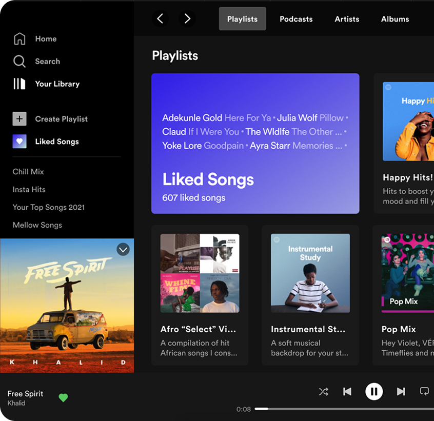

# 🎧 Clone do Spotify

Este projeto é um **clone da interface do Spotify**, criado como parte da formação Full Stack no curso **"O Novo Programador"**. O principal objetivo foi **praticar e dominar o uso de CSS Flexbox**, focando na construção de layouts modernos e responsivos.

---

## 📸 Resultado Final

---

## 🌐 Acesse o Projeto Publicado

➡️ [Clique aqui para visualizar online](https://codebyneander.github.io/spotify-clone/)

---

## 🚀 Objetivos do Projeto

- Reproduzir visualmente a interface do Spotify com HTML e CSS.
- Treinar intensivamente a **técnica de Flexbox**, uma das mais importantes no layout moderno.
- Aplicar boas práticas de organização de código e nomenclaturas de classes CSS.
- Praticar o design responsivo e refinamento visual de interfaces complexas.

---

## 🧠 Desafios Enfrentados

Este foi, até o momento, o projeto **mais difícil e complexo** da minha jornada como desenvolvedor. Durante a construção, enfrentei diversos desafios como:

- Alinhar corretamente os elementos com Flexbox.
- Reproduzir com precisão o posicionamento dos elementos no layout.
- Organizar o CSS de forma reutilizável e elegante.
- Garantir responsividade e fidelidade visual em diferentes tamanhos de tela.

Cada obstáculo foi uma grande oportunidade de aprendizado e crescimento!

---

## 📂 Tecnologias Utilizadas

- HTML5
- CSS3 (com ênfase em **Flexbox**)
- Google Fonts
- Organização baseada em boas práticas de desenvolvimento front-end

---

## 🔄 Próximos passos

- Adicionar redirecionamento para outras páginas clicando nos botões e playlists;
- Refatorar para uso com React em um segundo momento;

---

## 👤 Autor

- Nome: **Renan Guilherme**
- Instagram Dev: [@renanguilherme.dev](https://instagram.com/renanguilherme.dev)
- LinkedIn: [Renan Guilherme](https://linkedin.com/in/renan-guilherme)

---

## 🙏 Agradecimentos

Agradeço ao curso **O Novo Programador** pela proposta prática, e também à mim mesmo pela consistência nessa fase de evolução como dev.

---

> Projeto desenvolvido como parte do meu processo de crescimento no mundo do desenvolvimento web. Um pequeno passo no código, um salto na jornada. 🚀

> Quinta, 08 de Maio de 2025
